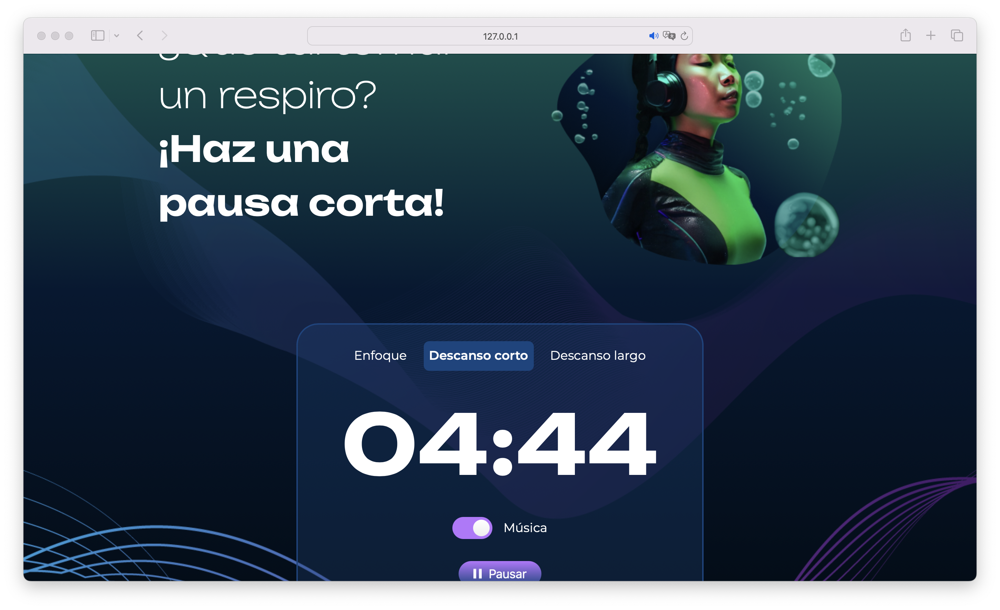
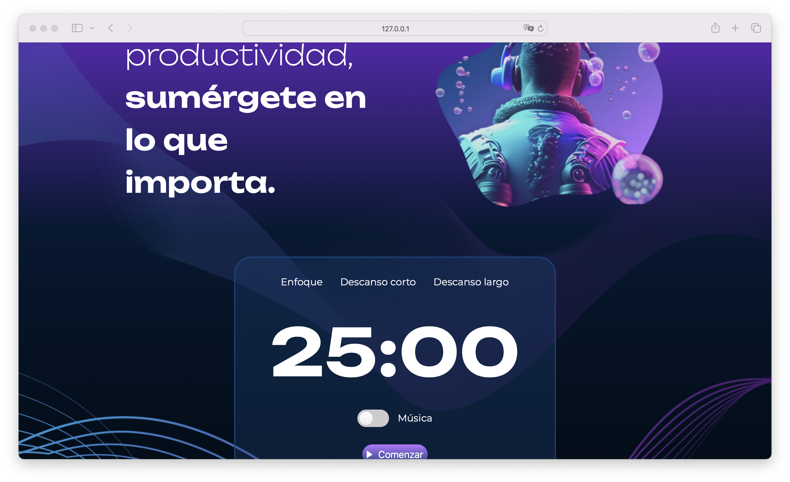

# Fokus

**Fokus** is an application inspired by the Pomodoro technique, designed to improve time management for specific activities. It offers three timing modes: Focus (25 minutes), Short Break (5 minutes), and Long Break (15 minutes), each adjustable to suit your needs. Additionally, it includes an option to activate ambient music and adapts the visual interface based on the active mode, providing distinctive text and colors for a more focused and productive experience. Fokus is aimed at anyone looking to optimize their productivity and concentration during work or study periods, making it useful for students, professionals, and anyone interested in better managing their time and maintaining efficient work sessions.

## Screenshots

## Tech Stack

**Client:** HTML, CSS, JavaScript

## Prerequisites

- **Visual Studio Code (VSCode)**: You can download it from [Visual Studio Code](https://code.visualstudio.com/).

## Installation Steps

### Download the project:

1. Download the project from the repository or directly as a ZIP file.

### Open the project in Visual Studio Code:

1. Unzip the ZIP file (if you downloaded the project as a ZIP).
2. Open Visual Studio Code.
3. Select `File` > `Open Folder` and navigate to the downloaded project folder.

### Run the application:

1. If you're only using HTML, CSS, and JavaScript, simply open the `index.html` file in your preferred web browser.
2. Alternatively, you can use the Live Server extension in VSCode to run the application locally:
   - Install the **Live Server** extension from the VSCode marketplace.
   - Right-click the `index.html` file and select `Open with Live Server`.

That's it! You should now be able to see and use the **Fokus** application in your browser.

## Author

- [@jorgedoiany](https://github.com/jorgedoiany)
